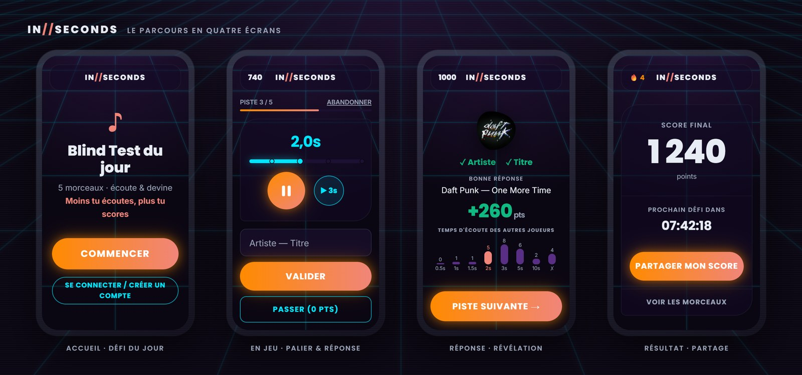

[🇫🇷 Lire en français](README.fr.md)

# InSeconds 🎵

**▶ Play now: [https://inseconds.cc](https://inseconds.cc)**

[](https://github.com/Oasis35/InSeconds/actions/workflows/ci.yml)



> Daily music blind test. Listen as briefly as you can, guess artist + title. Less time = more points. Same challenge for everyone, every day.

## How it works

- Each day at midnight UTC, a new set of tracks is automatically selected (only tracks with an active Deezer preview, outside a configurable reuse cooldown); if the midnight job fails, the challenge is regenerated automatically when the first player arrives (deterministic selection: same challenge for everyone)
- Preview availability is re-checked nightly against Deezer (rate-limit aware, batched calls); admins can also re-run the check on demand from the admin panel
- Playback starts automatically at the shortest step (0.5s); extend step by step (1, 1.5, 2, 3, 5, 10s) with "listen more" before attempting artist + title
- Free, unlimited "listen more" extensions per track (up to the last duration tier) — scoring is always based on the final tier listened, no penalty for extending
- Optional hints (release year, then a masked artist name) unlockable at 5s/10s of listening — costs points, server-authoritative
- Scoring is entirely server-side — no client-side manipulation possible
- Guest mode: play without signing up (no leaderboard, only global stats)
- Optional linked accounts (open signup, passwordless magic-link login) — keeps history/streak across devices; guest play stays fully open regardless
- Daily streak shown in the header (details panel on click), with streak freezes for linked accounts (1 free on signup, +1 every 7 days, 2 max, used automatically on a missed day)
- Share your score in Wordle-style emoji format via the clipboard
- Available in French and English — auto-detected from the browser, switchable anytime from the footer (choice saved in localStorage)
- Privacy policy page at `/privacy` (also `/confidentialite`)

## Quick start

### Prerequisites

- Docker Desktop (for the database + API containers)
- Node.js 22+ and npm
- Angular CLI 22+ (`npm install -g @angular/cli`)
- .NET 10 SDK (only if you want to run the API outside Docker)

### Run the backend

```bash
cp .env.example .env   # first time only, then set DB_PASSWORD
docker compose up -d
```

This starts:

- `inseconds.database` — PostgreSQL on `localhost:5432`
- `inseconds.api` — .NET 10 API on `http://localhost:5171` with `dotnet watch` hot-reload

EF Core migrations are applied automatically on startup.

### Run the frontend

```bash
cd src/front/InSeconds.Client
npm install   # first time only
npm start
```

Open `http://localhost:5173`.

### Useful URLs

| URL | Purpose |
|-----|---------|
| `http://localhost:5173` | Frontend (Angular dev server) |
| `http://localhost:5171/health` | API liveness check (app is serving requests) — also returns the build date (`build`) to identify the deployed version |
| `http://localhost:5171/health/ready` | API readiness check (database reachable) |
| `http://localhost:5171/openapi/v1.json` | OpenAPI spec (used by NSwag for client generation) |

## Stack

| Layer | Tech |
|-------|------|
| Backend | .NET 10, Wolverine messaging, FluentValidation, EF Core 10 |
| Database | PostgreSQL (Docker in dev, shared Postgres container on the VPS in prod) |
| Frontend | Angular 22 (standalone + signals), TypeScript, Tailwind CSS v4, SCSS |
| Music | Deezer API (search, 30s previews, cover art) |
| Infra dev | Docker Compose, `dotnet watch` (backend), `ng serve` (frontend) |
| Deployment | OVH VPS (Debian), Docker Compose behind Caddy (reverse proxy, auto HTTPS), GitHub Actions CI/CD |

## Repository structure

```
InSeconds/
├── deploy/                    # Shared VPS stacks (Postgres infra, Caddy reverse proxy)
├── docs/                      # Architecture notes (FR)
├── scripts/                   # run-e2e.ps1 (local E2E runner)
├── src/
│   ├── back/
│   │   ├── InSeconds.slnx              # .NET solution (.slnx format)
│   │   ├── InSeconds.Api/              # Web API (vertical slice architecture)
│   │   ├── InSeconds.Deezer/           # Deezer client (separate project, cache + resilience)
│   │   ├── InSeconds.Api.UnitTests/    # xUnit unit tests (no DB)
│   │   └── InSeconds.Api.IntegrationTests/ # xUnit integration tests (Testcontainers)
│   └── front/
│       └── InSeconds.Client/  # Angular app
├── docker-compose.yml         # Dev: database + API
├── docker-compose.prod.yml    # Prod: API + front (VPS)
└── README.md / README.fr.md
```

## Continuous integration

GitHub Actions workflow on every push and every PR to `main`:

- **Backend** — build in Release + `dotnet ef migrations has-pending-model-changes`
- **Unit tests** — `dotnet test` on `InSeconds.Api.UnitTests` (xUnit, no DB required)
- **Frontend** — `npm ci` + production build
- **Frontend unit tests** — `ng test --watch=false --browsers=ChromeHeadless` (Karma + Jasmine, ~360 tests)
- **Integration tests** — `dotnet test` on `InSeconds.Api.IntegrationTests` (Testcontainers spins up a real PostgreSQL container, no extra YAML needed)
- **E2E** — Playwright tests (Chromium) against a real backend in `Testing` mode with a PostgreSQL service — runs after all jobs above pass
- **Nginx cache headers smoke test** — builds and runs the actual production Docker image (`Dockerfile.prod`), checks `Cache-Control` headers and the `Content-Type` of `robots.txt`/`sitemap.xml` via `curl` (`src/front/InSeconds.Client/scripts/check-nginx-cache-headers.sh`) — the only job that exercises `nginx.conf`

Stale runs are cancelled automatically.

## Testing

### Unit tests (backend)

```bash
cd src/back
dotnet test InSeconds.Api.UnitTests
```

Covers `ScoreCalculator`, `TextNormalizer`, `SettingsService` and other Common services, the `Player`/`GameSession` entities (streak, freezes, anti-cheat) and the Deezer client. No database required (pure logic).

### Unit tests (frontend)

```bash
cd src/front/InSeconds.Client
npx ng test --watch=false --browsers=ChromeHeadless
```

**~360 tests** across 37 spec files (Karma + Jasmine), covering `App`, `GameService`, `SettingsService`, `LanguageService`, `GameFooterComponent` (language toggle), `AdminHttpService`, `AdminStatsService`, `AdminPoolService` (pool runway), `BlindRoundComponent` (autocomplete keyboard navigation), `GuessTimeChartComponent` + `TrackResultsListComponent` (guess-time histogram + popup), `ChallengesTabComponent` (player identity chips + guess-time popup), `ClipboardService`, `PlayerSessionService`, `BrowserIdComponent`, the services extracted from the game round (search, submission, hints), streak freezes (panel, freeze cells, header pill), plus the login/profile/email-change flows. Uses `HttpTestingController` — no real HTTP calls.

### Integration tests (backend)

```bash
cd src/back
dotnet test InSeconds.Api.IntegrationTests
```

Requires Docker (Testcontainers starts a real PostgreSQL container). **180 tests** covering `GetTodaySession` (read-only, creates neither player nor session), `StartSession`, `SubmitAnswer`, `AbandonSession`, `Stats/Today`, `AdminStats` (Dashboard: KPIs, activity, player breakdown) + `ChallengeStats` (`GET /api/admin/challenge-stats`, the "per-challenge stats" endpoint split off the Dashboard — including the per-challenge player list), `Players` (`GET /api/players/me`), `PlayerSoftDelete`, `SessionEdgeCases` (lazy expiry, streak — including finishing yesterday's challenge after midnight UTC, submit on abandoned session, UpdateListening anti-cheat), `ChallengeGeneration`, `LazyChallengeGeneration` (on-the-fly challenge regeneration), `Admin/Tracks`, `Admin/Challenges`, `Admin/RefreshPreviews`, `Admin/RefreshReleaseYears`, `RequestHint` (hint unlock/penalty), `DeezerSearch` (public autocomplete cleanup + deduplication), magic-link login, pseudo and email changes, streak freezes (`StreakFreeze`), guess-time distribution histogram on submitted answers + on `Stats/Today` + `ChallengeStats` TrackStat (per-track score + histogram), title-cleaning on every display path (submitted answer, resumed session, "already played" stats, admin challenges stats), `HealthCheck`.

### E2E tests (Playwright)

```bash
# One command — resets Docker, starts backend in Testing mode, runs all tests
powershell -File scripts/run-e2e.ps1
```

Or if the backend is already running in Testing mode:

```bash
cd src/front/InSeconds.Client
npm run e2e        # headless
npm run e2e:ui     # interactive Playwright UI
```

**~86 tests** in 20 spec files — ~62 game tests (streak freezes, happy path, already-played, login/profile/email-change flows, login nudges, abandon, resume, multi-tab sync, no-challenge + automatic rebirth of a deleted challenge, share + clipboard failure, scoring, guess-time histogram on the reveal screen + in the recap/already-played track list popup, anti-cheat min duration lock, leave-confirmation guard, clear-search button, autocomplete cleanup/deduplication + keyboard navigation, service-down overlay, footer language toggle + privacy page) + 24 admin tests (login, pool table with filters, add track via the integrated search panel, delete track, generate challenge, reset sessions, challenge list, browser ID display/copy, player chip "it's you" highlighting, per-track guess-time histogram popup, lazy per-tab loading — deferred network calls + deferred tab counter).

The backend runs in `ASPNETCORE_ENVIRONMENT=Testing` which activates:
- `FakeDeezerHandler` — returns a local `test-audio.mp3`; tracks with DeezerTrackId >= 9_000_000_000 return an empty preview (5 seed tracks: The Beatles, Pink Floyd, Bob Dylan, Led Zeppelin, Fleetwood Mac) to test the "missing preview" filter/red indicator and the general "Re-check previews" button
- `PurgeSeedData` + `SeedData` on every startup (55 tracks total)
- `DELETE /api/e2e/reset` endpoint for test isolation

## Documentation

- [`docs/COMMENCE_ICI_FR.md`](docs/COMMENCE_ICI_FR.md) — project entry point and state overview
- [`docs/TACHES.md`](docs/TACHES.md) — task list
- [`docs/BACKEND_STRUCTURE_FR.md`](docs/BACKEND_STRUCTURE_FR.md) — backend architecture reference
- [`docs/FRONTEND_STRUCTURE_FR.md`](docs/FRONTEND_STRUCTURE_FR.md) — frontend architecture reference
- [`docs/GAMEPLAY_RULES_FR.md`](docs/GAMEPLAY_RULES_FR.md) — gameplay rules (scoring, extension, anti-cheat, streak) — what's actually enforced vs just configured
- [`CLAUDE.md`](CLAUDE.md) — repo conventions and gotchas (read this before contributing)

## License

[PolyForm Noncommercial 1.0.0](LICENSE) — free to use, modify and distribute for any noncommercial purpose (personal, educational, hobby, research). Commercial use requires a separate agreement with the author.

## Contact

<contact@inseconds.cc>
